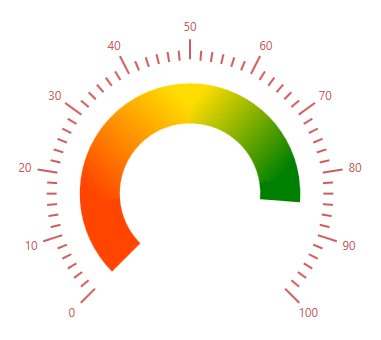

# How-to-apply-gradient-color-for-ranges-in-WPF-circular-gauge-SfCircularGauge-

This article explains How to apply gradient color for ranges in WPF circular gauge (SfCircularGauge)


 
## Creating the above UI

You can achieve the above UI using the below code snippet

[XAML]

```
        <gauge:SfCircularGauge>
            <gauge:SfCircularGauge.Scales>
                <gauge:CircularScale LabelStroke ="IndianRed" LabelOffset="0.77" LabelPosition="Custom" MinorTicksPerInterval="5" RangePosition="Custom" TickPosition="Custom" RimStroke="White">
                    <gauge:CircularScale.Ranges>
                        <gauge:CircularRange StartValue="0" EndValue="85" Offset="0.5" StrokeThickness="40" >
                            <gauge:CircularRange.GradientStops>
                                <gauge:GaugeGradientStop Value="15" Color="OrangeRed"/>
                                <gauge:GaugeGradientStop Value="50" Color="#FFDD00"/>
                                <gauge:GaugeGradientStop Value="80" Color="Green"/>
                            </gauge:CircularRange.GradientStops>
                        </gauge:CircularRange>
                    </gauge:CircularScale.Ranges>
                    <gauge:CircularScale.MajorTickSettings>
                        <gauge:MajorTickSetting  Length="20" Stroke="IndianRed" StrokeThickness="2"  Offset="0.7"  />
                    </gauge:CircularScale.MajorTickSettings>
                    <gauge:CircularScale.MinorTickSettings>
                        <gauge:MinorTickSetting  Stroke="IndianRed"  StrokeThickness="2" Offset="0.65"  />
                    </gauge:CircularScale.MinorTickSettings>
                    <gauge:CircularScale.Pointers>
                        <gauge:CircularPointer PointerType="NeedlePointer" Visibility="Collapsed"/>
                    </gauge:CircularScale.Pointers>
                </gauge:CircularScale>
            </gauge:SfCircularGauge.Scales>
        </gauge:SfCircularGauge>
```

KB article - [How-to-apply-gradient-color-for-ranges-in-WPF-circular-gauge-SfCircularGauge](https://www.syncfusion.com/kb/12029/how-to-apply-gradient-color-for-ranges-in-wpf-circular-gauge-sfcirculargauge)

## See also

[How to customize the range in WPF circular Gauge](https://help.syncfusion.com/wpf/radial-gauge/ranges#range-customization)

[How to Set a start and end values for range in WPF circular Gauge](https://help.syncfusion.com/wpf/radial-gauge/ranges?cs-save-lang=1&&cs-lang=csharp)

[How to set a width for range in WPF circular Gauge](https://help.syncfusion.com/wpf/radial-gauge/ranges?cs-save-lang=1&&cs-lang=csharp)

[How to bind a range color to scale tick and labels in WPF circular Gauge](https://help.syncfusion.com/wpf/radial-gauge/ranges?cs-save-lang=1&cs-lang=csharp#binding-range-color-to-scale-tick-and-labels)

[How to set a position for range in WPF circular Gauge](https://help.syncfusion.com/wpf/radial-gauge/ranges?cs-save-lang=1&cs-lang=csharp#setting-a-position-for-range)

[How to set a multiple range in WPF circular Gauge](https://help.syncfusion.com/wpf/radial-gauge/ranges?cs-save-lang=1&cs-lang=csharp#setting-a-multiple-ranges)

[How to set a gradient color for range in WPF circular Gauge](https://help.syncfusion.com/wpf/radial-gauge/ranges?cs-save-lang=1&cs-lang=csharp#setting-gradient-color-for-range)

